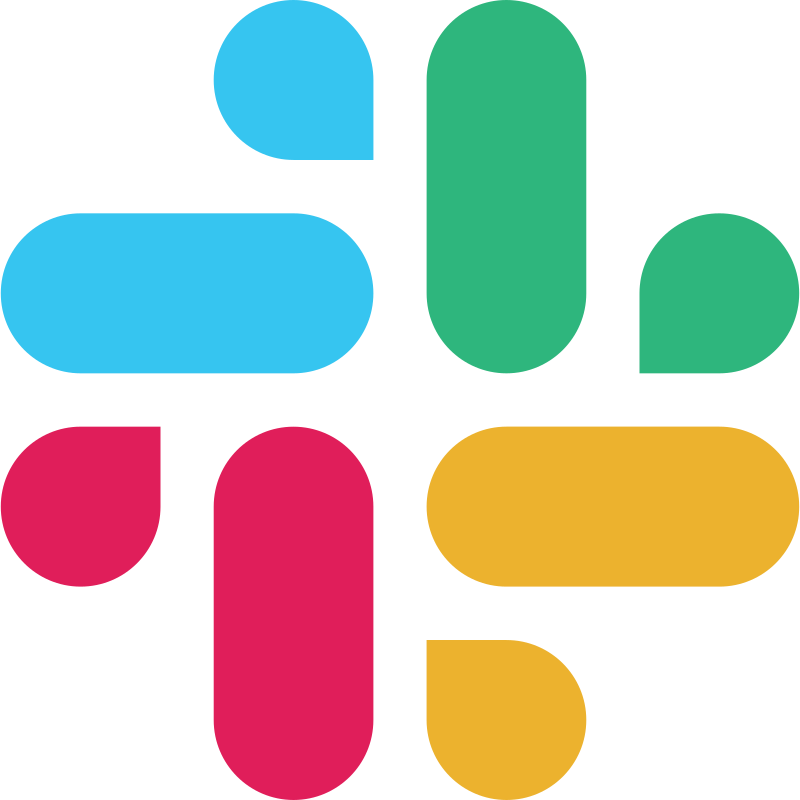

# rocketseat_projeto_java_01

### description and team

Time de desenvolvedores formado pelo Mercado Livre e a Rocketseat para a criação e apresentação de projeto sobre o treinamento Java (Wave 2 | 2024).

| Nome                        | LinkedIN                                                                                                                                 | Slack                                                                                                                                      | BU                                                                                                                                 |
|-----------------------------|------------------------------------------------------------------------------------------------------------------------------------------|--------------------------------------------------------------------------------------------------------------------------------------------|------------------------------------------------------------------------------------------------------------------------------------|
| Daniela Beleze Karasawa     | <p align="center">[](https://www.linkedin.com/in/danielakarasawa)</p> | <p align="center">[](https://meli.enterprise.slack.com/team/UTKTT9ZQQ)</p>   | <p align="center">[](http://www.mercadolivre.com.br)</p>     |
| Felipe dos Santos Geroldi   | <p align="center">[](https://www.linkedin.com/in/felipe-geroldi/)</p> | <p align="center">[](https://meli.enterprise.slack.com/team/U06Q43CQ5KN)</p> | <p align="center">[](http://www.mercadolivre.com.br)</p> |
| Sophia Fiama da Silva       | <p align="center">[](https://www.linkedin.com/in/sophiafiama/)</p>    | <p align="center">[](https://meli.enterprise.slack.com/team/U03PXBS6T98)</p> | <p align="center">[](http://www.mercadopago.com.br)</p>          |
| Tayna Alves Rodrigues       | <p align="center">[](https://www.linkedin.com/in/oituty/)</p>         | <p align="center">[](https://meli.enterprise.slack.com/team/U06PV0E0T0W)</p> | <p align="center">[](http://www.mercadolivre.com.br)</p> |
| Vinicius Ventura de Andrade | <p align="center">[](https://www.linkedin.com/in/vini-ventura29/)</p> | <p align="center">[](https://meli.enterprise.slack.com/team/U06PV004UDC)</p> | <p align="center">[](http://www.mercadolivre.com.br)</p> |

### how to test the project

```
Para testar:

start main

[POST] http://localhost:8080/cursos

body
{
    "name": "Nome do Curso",
    "description": "Descrição do Curso"
}
```